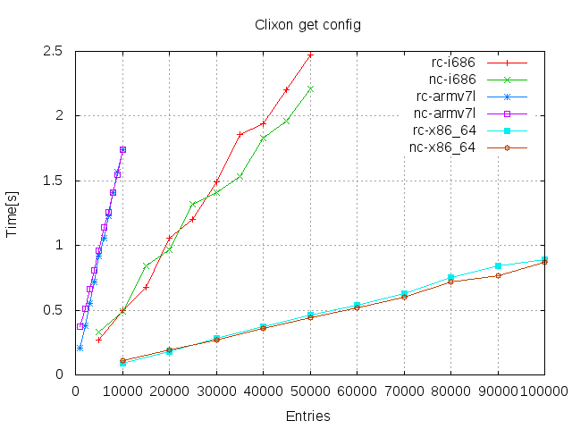
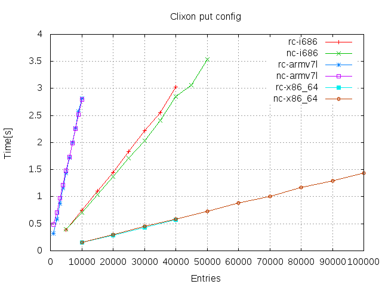
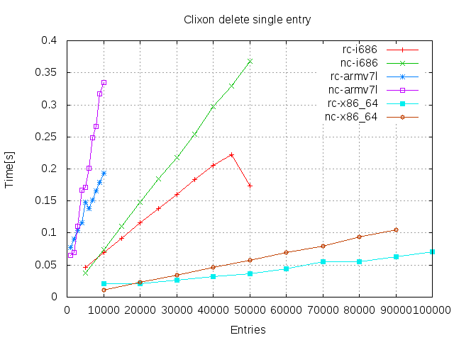

# Large lists in Clixon

Olof Hagsand, 2019-04-17

  * [1. Background](#1-background)
  * [2. Overview](#2-overview)
  * [3. Tests](#3-tests)
  * [4. Results](#4-results)
  * [5. Discussion](#5-discussion)
  * [6. Future work](#6-future-work)
  * [7. References](#7-references)

## 1. Background

CIixon can handle large configurations. Here, large number of elements
in a "flat" list is presented.  There are other scaling usecases,
such as large configuratin "depth", large number of requesting
clients, etc.

Thanks to [Netgate](www.netgate.com) for supporting this work.

## 2.Overview

The basic case is a large list, according to the following Yang specification:
```
   container x {
      description "top-level container";
      list y {
         description "List with potential large number of elements";
         key "a";
         leaf a {
            description "key in list";
            type int32;
         }
         leaf b {
            description "payload data";
            type string;
         }
      }
   }
```
where `a` is a unique key and `b` is a payload, useful in replace operations.

XML lists with `N` elements are generated based on
this configuration, eg for `N=10`:
```
   <y><a>0</a><b>0</b></y>
   <y><a>1</a><b>1</b></y>
   <y><a>2</a><b>2</b></y>
   <y><a>3</a><b>3</b></y>
   <y><a>4</a><b>4</b></y>
   <y><a>5</a><b>5</b></y>
   <y><a>6</a><b>6</b></y>
   <y><a>7</a><b>7</b></y>
   <y><a>8</a><b>8</b></y>
   <y><a>9</a><b>9</b></y>
```

Requests are either made over the _whole_ dataset, or for one specific element. The following example shows a Restconf GET operation of a single element:
```
   curl -X GET http://localhost/restconf/data/scaling:x/y=3
   {"scaling:y": [{"a": 3,"b": "3"}]}

```

Operations of single elements (transactions) are made in a burst of
random elements, typically 100. 

## 3. Tests

All details of the setup are in the [test script](../../test/plot_perf.sh).

### Testcases

All tests measure the "real" time of a command on a lightly loaded
machine using the Linux command `time(1)`.

The following tests were made (for each architecture and protocol):
* Write `N` entries in one single operation. (With an empty datastore)
* Read `N` entries in one single operation. (With a datastore of `N` entries)
* Commit `N` entries (With a candidate of `N` entries and empty running)
* Read 1 entry (In a datastore of `N` entries)
* Write/Replace 1 entry (In a datastore of `N` entries)
* Delete 1 entry (In a datastore of `N` entries)

The tests are made using Netconf and Restconf, except commit which is made only for Netconf.

### Architecture and OS

The tests were made on the following hardware, all running Ubuntu Linux:

#### i686

* IBM Thinkpad X60
* Dual Intel Core Duo processor 
* Ubuntu 16.04.6 LTS
* Linux version 4.4.0-143-generic (buildd@lgw01-amd64-037)
  * gcc version 5.4.0 20160609 (Ubuntu 5.4.0-6ubuntu1~16.04.10)
  * #169-Ubuntu SMP Thu Feb 7 07:56:51 UTC 2019

#### ARM

* Raspberry PI 2 Model B
* ARMv7 Processor rev 5 (v7l) 
* Raspbian GNU/Linux 9
* Linux version 4.14.79-v7+ (dc4@dc4-XPS13-9333)
  * gcc version 4.9.3 (crosstool-NG crosstool-ng-1.22.0-88-g8460611))
  * #1159 SMP Sun Nov 4 17:50:20 GMT 2018

#### x86_64

* Intel NUC Coffee Lake
* Intel Quad-core I5-8259U 
* Ubuntu 18.04.1 LTS
* Linux version 4.15.0-47-generic (buildd@lgw01-amd64-001)
  * gcc version 7.3.0 (Ubuntu 7.3.0-16ubuntu3)
  * #50-Ubuntu SMP Wed Mar 13 10:44:52 UTC 2019

## 4. Results

### Access of the whole datastore

This section shows the results of the measurements as defined in [Tests](#tests).






### Access of single entries




### Profiling

An example profiling of the most demanding case was made: Put single restconf for with 5000 existing entries.
The tool used is valgrind/callgrind with the following approximate result (percentage of total cycles):
* from_rpc_callback 100%
  * from_client_commit 65%
    * candidate_commit 65%
      * from_validate_common 30%
        * xml_diff 13%
	* xml_yang_validate_all 10%
      * xmldb_copy 29%
        * xml_copy 22%
  * from_client_edit_config 35%
    * xmldb_put 35%
      * clicon_xml2file 30%
        * fprintf 13%
        * xml_chardata_encode 12%

It can be seen that most cycles are spend in file copying and writing
the existing datastore to file. This explains the linear behaviour, ie
the larger existing datastore, the larger number of cycles spent.

Why is the existing datastore accessed in this way? When a small PUT request is received, several things happen:
* The existing candidate database is modified with the change and written to disk. (35%)
* The difference between candidate and running is computed (13%)
* The new candidate is validated (10%)
* The candidate db is copied to running (29%)

## 5. Discussion

All measurements show clear performance differences between the
architectures, which was expected.

By looking at top and other tools, it seems clear that the main
bootleneck is CPU for the `clixon_backend`. The clients, eg `nginx`,
clixon_restconf` and `clixon_netconf` seem negligable. Memory
footprint is also not limiting.

Accessing the whole configuration is similar between protocols and
linear in time. This is to be expected since the tranfer is dependent
on the size of the database.

Accessing a single entry is also similar in all cases and shows large
differences. As expected, the CPU architecture is significant, but
there is also a large difference between Netconf and Restconf.

The Netconf and restconf setups differ somewhat which may explain
differences in performance. Primarily, the Netconf input is piped to a
single Netconf client while a curl is re-started for each Restconf
call. Also, the Restconf PUT includes a commit.

Further, the single entry access is linear wrt number of entries. This
means it is possible to run large scale applications on high
performance CPUs, such as 100K entries on a x86_64 in the results, but
it also means that very large lists may not be supported, and that the
system degrades with the size of the lists.

Examining the profiling of the most demanding Restconf PUT case, most
cycles are spent on handling writing and copying the existing datastore.

Concluding, the 

## 6. Future work

* Improve access of single list elements to sub-linear performance.
* CLI access on large lists (not included in this study)

## 7. References

* [RFC6241](https://tools.ietf.org/html/rfc6241) "Network Configuration Protocol (NETCONF)"
* [RFC8040](https://tools.ietf.org/html/rfc8040) "RESTCONF Protocol"
* [plot_perf.sh](../../test/plot_perf.sh) Test script
